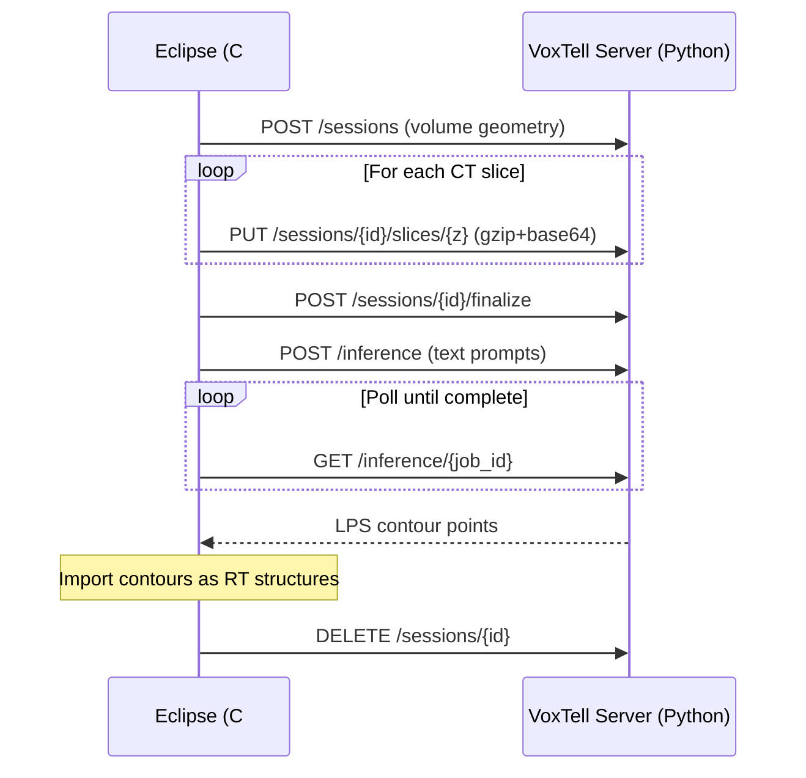

<p align="center">
  
</p>

<h1 align="center">VoxTell ESAPI</h1>

> **Free-text-prompted 3D medical image segmentation, integrated into Varian Eclipse for clinical contouring.**

<p align="center">
  <a href="voxtell-server/LICENSE"></a>
  
  
  
  <a href="https://arxiv.org/abs/2511.11450"></a>
</p>

---

## What is this?

[VoxTell](https://github.com/MIC-DKFZ/VoxTell) is a vision-language 3D medical image segmentation model developed by the [Medical Image Computing Lab (MIC)](https://www.dkfz.de/en/mic/index.php) at DKFZ Heidelberg. Given a CT volume and a plain-text anatomical prompt (e.g. `"liver"`, `"left kidney"`), it produces a 3D segmentation mask — no pre-defined label set required.

This project is a **fork of VoxTell** that adds two components to bring it into a clinical workflow:

- **[VoxTell Server](voxtell-server/README.md)** — A Python/FastAPI REST API that accepts CT data over HTTP, runs VoxTell inference on GPU, and returns contour points in DICOM patient coordinates.
- **[VoxTell Interface](voxtell_interface/README.md)** — A C# Eclipse Scripting API (ESAPI) plugin that streams CT volumes from Varian Eclipse to the server and imports the resulting contours as RT structures.

> [!NOTE]
> This is an independent extension of the original [MIC-DKFZ/VoxTell](https://github.com/MIC-DKFZ/VoxTell) repository. The upstream model code is unmodified; all additions live in the `api/` package (server) and `voxtell_interface/` directory (Eclipse plugin).

---

## VoxTell Model Architecture

<p align="center">
  
</p>

<p align="center"><em>VoxTell uses a vision-language architecture that combines a 3D image encoder with a text embedding model (Qwen3-Embedding-4B) to perform prompted segmentation on arbitrary anatomy.</em></p>

---

## Feature Highlights

- **Free-text segmentation** — Describe any anatomy in plain English; no fixed label set
- **DICOM coordinate conversion** — Automatic LPS ↔ RAS transforms between Eclipse and NIfTI worlds
- **Async session workflow** — Stream 200+ CT slices over HTTP without blocking the Eclipse UI
- **Auto-structure creation** — New structures are created in Eclipse automatically if they don't exist
- **Multi-prompt support** — Segment multiple anatomies in a single inference pass
- **GPU-accelerated** — CUDA-powered inference with single-request GPU locking for stability

---

## Architecture



### How It Works

1. **Upload** — The Eclipse plugin extracts CT voxels slice-by-slice, compresses them (gzip + base64), and streams them to the server over HTTP.
2. **Reconstruct** — The server assembles the slices into a NIfTI volume, converting from DICOM LPS to NIfTI RAS coordinates via a 4×4 affine transform.
3. **Segment** — VoxTell runs inference on the volume using free-text prompts, producing binary 3D masks.
4. **Return** — Masks are converted back to DICOM LPS contour points and returned to Eclipse, where they are drawn as RT structures.

For the full coordinate conversion pipeline, see the [Data Conversion Pipeline](voxtell-server/README.md#the-data-conversion-pipeline) in the server docs.

---

## Quick Start

### Server Setup

```bash
conda create -n voxtell python=3.12 -y && conda activate voxtell
pip install torch --index-url https://download.pytorch.org/whl/cu118
git clone https://github.com/gomesgustavoo/VoxTell-ESAPI.git && cd VoxTell-ESAPI/voxtell-server
pip install -e ".[api]"
python download_model.py
VOXTELL_MODEL_DIR=./models bash run.sh
```

See the full [Server README](voxtell-server/README.md) for prerequisites, configuration, and API reference.

### Eclipse Plugin

- Build the C# solution in Visual Studio (requires Varian ESAPI DLLs from a licensed Eclipse installation)
- Deploy the `.esapi.dll` to your Eclipse scripts directory
- Launch from Eclipse's scripting menu — connect, upload, segment, import

See the full [Interface README](voxtell_interface/README.md) for build instructions, usage workflow, and configuration.

---

## Project Structure

```
VoxTell-ESAPI/
├── voxtell-server/              # Python FastAPI backend
│   ├── api/                     #   REST API package
│   │   ├── main.py              #     Routes & app lifespan
│   │   ├── schemas.py           #     Pydantic request/response models
│   │   ├── config.py            #     Environment settings
│   │   ├── session_manager.py   #     In-memory session & job store
│   │   ├── nifti_builder.py     #     DICOM LPS ↔ NIfTI RAS conversion
│   │   ├── contour_utils.py     #     Mask → LPS contour extraction
│   │   └── voxtell_worker.py    #     Model inference wrapper
│   ├── download_model.py        #   Model weight downloader
│   ├── run.sh                   #   Server startup script
│   └── README.md                #   Server documentation
│
├── voxtell_interface/           # C# ESAPI Eclipse plugin
│   └── VoxTell-Interface/
│       ├── Script.cs            #   ESAPI entry point
│       ├── Models/              #   API data transfer objects
│       ├── Services/            #   HTTP client, voxel encoder, structure importer
│       ├── ViewModels/          #   UI logic & workflow orchestration
│       ├── Views/               #   WPF user interface
│       └── README.md            #   Interface documentation
│
└── README.md                    # ← You are here
```

---

## Citation & Acknowledgments

VoxTell was developed by Rokuss et al. at [DKFZ Heidelberg](https://www.dkfz.de/en/mic/index.php). If you use this work, please cite the original paper:

> **Rokuss, M. et al.** (2025). *VoxTell: Free-Text Promptable Universal 3D Medical Image Segmentation*. arXiv:2511.11450.

```bibtex
@misc{rokuss2025voxtell,
  title={VoxTell: Free-Text Promptable Universal 3D Medical Image Segmentation},
  author={Maximilian Rokuss and Moritz Langenberg and Yannick Kirchhoff and Fabian Isensee and Benjamin Hamm and Constantin Ulrich and Sebastian Regnery and Lukas Bauer and Efthimios Katsigiannopulos and Tobias Norajitra and Klaus Maier-Hein},
  year={2025},
  eprint={2511.11450},
  archivePrefix={arXiv}
}
```

Thanks to Max and Moritz for developing this amazing work.

---

## License

This project is released under the **Apache 2.0 License** — see [LICENSE](voxtell-server/LICENSE) — consistent with the upstream VoxTell project.

> [!IMPORTANT]
> The Eclipse plugin depends on **Varian Medical Systems proprietary DLLs** that are **not redistributable** and are **not included** in this repository. A licensed Eclipse installation is required to build the plugin. See the [Interface README](voxtell_interface/README.md#proprietary-dll-notice) for details.

---

## Contact

- LinkedIn: [gustavoogomesss](https://www.linkedin.com/in/gustavoogomesss/)
- Issues: [GitHub Issues](https://github.com/gomesgustavoo/VoxTell-ESAPI/issues)
