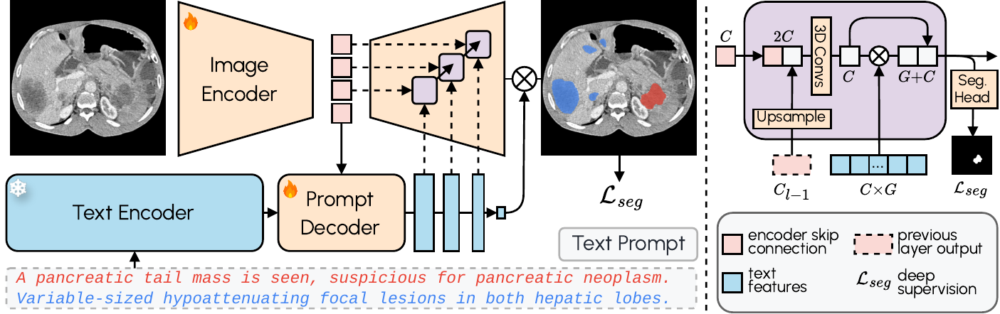

<p align="center">
  
</p>

<h1 align="center">VoxTell ESAPI</h1>

> **Free-text-prompted 3D medical image segmentation, integrated into Varian Eclipse for clinical contouring.**

<p align="center">
  <a href="LICENSE"></a>
  
  
  <a href="https://arxiv.org/abs/2511.11450"></a>
</p>

---

## What is this?

[VoxTell](https://github.com/MIC-DKFZ/VoxTell) is a vision-language 3D medical image
segmentation model from the [Medical Image Computing Lab (MIC)](https://www.dkfz.de/en/mic/index.php)
at DKFZ Heidelberg, accepted at CVPR 2026. Give it a volume and a plain-text
anatomical prompt — `"liver"`, `"left kidney"`, a whole clinical sentence — and it
produces a 3D mask.

This project brings that into a radiotherapy planning workflow:

- **[VoxTell Cloud](voxtell-cloud/README.md)** — a persistent, multi-user backend.
  Upload a CT once, queue a job, poll it, download contours in DICOM patient
  coordinates. Keycloak-backed users, API keys, a Postgres job queue, and one GPU
  shared fairly between callers.
- **[VoxTell Interface](voxtell-esapi-client/README.md)** — a C# Eclipse Scripting
  API (ESAPI) plugin that sends the volume from Varian Eclipse and imports the
  returned contours as RT structures.

> [!NOTE]
> An independent extension of [MIC-DKFZ/VoxTell](https://github.com/MIC-DKFZ/VoxTell).
> The model is used as an upstream dependency, pinned by commit — not vendored or
> modified. Everything here is the service and the Eclipse integration around it.

---

## VoxTell Model Architecture

<p align="center">
  
</p>

<p align="center"><em>A 3D image encoder fused with text-prompt embeddings from Qwen3-Embedding-4B, so any anatomy describable in words can be segmented — no fixed label set.</em></p>

---

## Feature highlights

- **Free-text segmentation** — describe any anatomy in plain English
- **DICOM coordinate correctness** — LPS ↔ RAS handled once, server-side, and
  verified against the source grid by the end-to-end test client
- **24/7 multi-user service** — a job queue rather than a blocking call, so several
  workstations share one GPU without fighting over it
- **Resumable single-shot upload** — the volume goes straight to object storage via
  presigned multipart URLs; no 200-round-trip slice streaming
- **Cancellable, restart-safe jobs** — a worker that dies mid-job self-heals
- **Auto-structure creation** — new structures appear in Eclipse automatically
- **Runs on-prem too** — the same images under `docker compose` for sites that
  cannot use a hosted service

---

## Quick start

### Backend

The hosted service needs no setup — sign in from the plugin with your DicomSegVR
account. To run your own:

```bash
git clone https://github.com/gomesgustavoo/VoxTell-ESAPI.git
cd VoxTell-ESAPI/voxtell-cloud
python scripts/fetch_models.py --dest ./models   # ~12 GB, once
docker compose up -d
docker compose exec api python -m scripts.mint_key --name local
```

See the [Cloud README](voxtell-cloud/README.md) for the Kubernetes deployment and
[PROTOCOL.md](voxtell-cloud/PROTOCOL.md) for the wire contract.

### Eclipse plugin

**Option A — pre-built (recommended):** download the latest `VoxTell-Interface.zip`
from [Releases](https://github.com/gomesgustavoo/VoxTell-ESAPI/releases), extract
both DLLs into your Eclipse scripts directory, and load the script from Eclipse's
scripting menu.

**Option B — from source:** build the C# solution in Visual Studio (requires the
Varian ESAPI DLLs from a licensed Eclipse installation), then deploy the
`.esapi.dll`.

> [!IMPORTANT]
> A **structure set must already exist** on the open patient before running any
> prompt — the plugin imports contours into the active structure set.

---

## Project structure

```
VoxTell-ESAPI/
├── voxtell-cloud/               # Python backend (the service)
│   ├── voxtell_cloud/           #   shared, torch-free: geometry, contours, wire format
│   ├── api/                     #   FastAPI control plane (no GPU)
│   ├── worker/                  #   GPU worker: queue, pipeline, model lifecycle
│   ├── console/                 #   small React SPA: API keys + job list
│   ├── scripts/                 #   model fetcher, key minter, end-to-end client
│   ├── PROTOCOL.md              #   ← the contract the C# client targets
│   └── README.md
│
├── voxtell-esapi-client/         # C# ESAPI Eclipse plugin
│   ├── VoxTell-Interface/
│   │   ├── Script.cs            #   ESAPI entry point
│   │   ├── Models/              #   wire DTOs
│   │   ├── Services/            #   HTTP client, encoder, Auth/ (PKCE + device code)
│   │   │                        #   Esapi*.cs — the only files that touch Eclipse
│   │   ├── ViewModels/          #   workflow orchestration
│   │   └── Views/               #   user interface
│   └── VoxTell-Interface.Harness/  # console app: the whole protocol, without Eclipse
│
└── docs/assets/                 # figures
```

> [!NOTE]
> Both halves now speak the **v2** protocol in [PROTOCOL.md](voxtell-cloud/PROTOCOL.md):
> one authenticated upload, a job queue, cancellation. The plugin signs in through the same
> Keycloak realm as the web console, and shows every result for review before a single
> contour reaches the patient's structure set.
>
> The v1 server has been removed: upstream now ships its own local single-user
> server (`voxtell-server`, from `pip install voxtell[server]`), which covers that
> use case better than our copy did.

---

## Citation & acknowledgments

VoxTell was developed at [DKFZ Heidelberg](https://www.dkfz.de/en/mic/index.php).
If you use this work, please cite the original paper:

> **Rokuss, M. et al.** (2026). *VoxTell: Free-Text Promptable Universal 3D Medical Image Segmentation*. CVPR 2026. arXiv:2511.11450.

```bibtex
@misc{rokuss2025voxtell,
  title={VoxTell: Free-Text Promptable Universal 3D Medical Image Segmentation},
  author={Maximilian Rokuss and Moritz Langenberg and Yannick Kirchhoff and Fabian Isensee and Benjamin Hamm and Constantin Ulrich and Sebastian Regnery and Lukas Bauer and Efthimios Katsigiannopulos and Tobias Norajitra and Klaus Maier-Hein},
  year={2025},
  eprint={2511.11450},
  archivePrefix={arXiv}
}
```

Thanks for developing this amazing project.

---

## License

Released under the **Apache 2.0 License** — see [LICENSE](LICENSE) — consistent with
the upstream VoxTell project.

> [!IMPORTANT]
> The Eclipse plugin depends on **Varian Medical Systems proprietary DLLs** that are
> **not redistributable** and are **not included** here. A licensed Eclipse
> installation is required to build it. See the
> [Interface README](voxtell-esapi-client/README.md#proprietary-dll-notice).

> [!WARNING]
> Segmentation output is decision *support*. Always review contours before clinical
> use. This software is not a medical device and carries no regulatory clearance.

---

## Contact

- LinkedIn: [gustavoogomesss](https://www.linkedin.com/in/gustavoogomesss/)
- Issues: [GitHub Issues](https://github.com/gomesgustavoo/VoxTell-ESAPI/issues)
