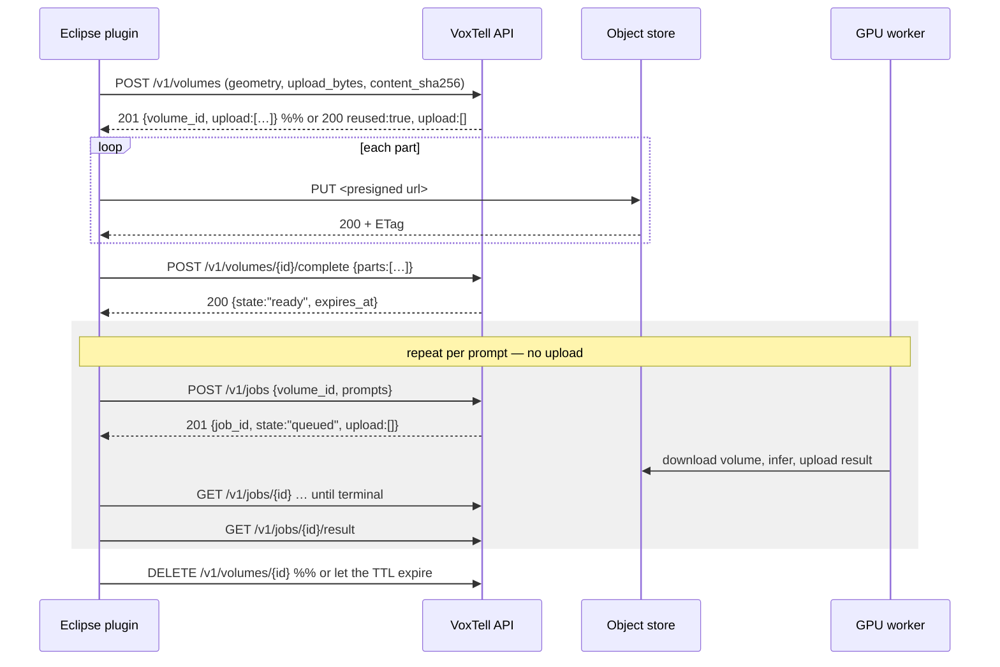
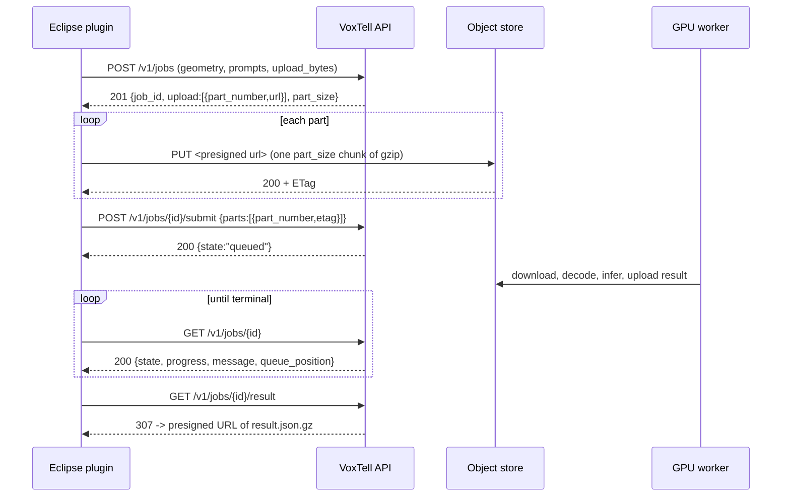

# VoxTell-Cloud wire protocol (v3)

> The contract the Eclipse ESAPI plugin talks to. Base URL:
> `https://voxtell.dicomsegvr.com/v1`

## What changed from v2, and why

v2 tied one upload to one job, so a planner who ran "liver", looked at the result
and then wanted "spleen" re-read the CT out of Eclipse slice by slice, re-gzipped
it, and re-uploaded every part. On a hospital uplink that is minutes per prompt for
bytes the server had just deleted.

v3 makes the volume its own resource: **upload the series once → run as many jobs
against it as you like.**

| | v2 | v3 |
|---|---|---|
| Upload scope | one per job | one per **series**, reused by many jobs |
| Repeat prompt on the same CT | full re-upload | no bytes at all |
| Volume identity | none | `content_sha256` + geometry, so re-opening the plugin also skips it |
| Quota booked at | job *create* | job *submit* |
| `awaiting_upload` holds a GPU slot | yes | no |
| Input volume deleted | at job completion | on a sliding TTL under a hard ceiling |

Three consequences worth calling out, because they are behaviour changes rather
than additions:

* **Quota is booked when a job is submitted, not created.** A `UsageEvent` used to
  be written before a single byte was uploaded, so a failed upload still spent one
  of the 200 monthly units. Related: `awaiting_upload` no longer counts against the
  outstanding-jobs cap. Together those fixed a real lockout — the cap is 6 and an
  abandoned upload was only reaped after 120 minutes, so six failed uploads inside
  two hours returned `429` with a `Retry-After: 30` that was wrong by two orders of
  magnitude. Open uploads are now bounded separately, by
  `VOXTELL_MAX_AWAITING_UPLOAD_PER_USER`.
* **`POST /v1/volumes` is idempotent; `POST /v1/jobs` still is not.** The content
  hash is a natural idempotency key, so the volume call can be retried safely. A
  job create has no such key, and a retry the server actually received leaves an
  orphan holding a slot — so it must not be retried.
* **The legacy inline shape still works, indefinitely.** Eclipse approves a plugin
  DLL by version *and* content hash, so a workstation cannot be upgraded on the
  server's schedule. `POST /v1/jobs` accepts either shape; check
  `GET /v1/me` → `capabilities` for `"volumes"` before using the new one.

## What changed from v1, and why

v1 streamed the CT **one slice at a time** (`PUT /sessions/{id}/slices/{z}`), which
meant 200+ HTTP round trips per study, an in-memory volume buffer per session, and
a server that could only ever run with `--workers 1`. State lived in a Python dict,
so a restart lost every session and two users could collide.

v2 replaces that with: **upload the volume once → queue → GPU → download the mask.**
No streaming, no server-side session, no per-user state in the process.

| | v1 | v2 |
|---|---|---|
| Upload | 200+ per-slice `PUT`s, base64+gzip | one gzip blob via presigned S3 multipart |
| Voxel type | int32 | **int16** (half the bytes) |
| Intensities | raw ESAPI stored values | **HU** (client sends slope/intercept, server rescales) |
| State | in-process dict | Postgres + object store |
| Auth | none | `vxt_` API key or Keycloak JWT |
| Concurrency | one user | queue with per-user fair-share |
| Cancel | none | `POST /jobs/{id}/cancel` |

Two details are worth calling out because they change results, not just plumbing:

* **int16, not int32.** CT stored values and Hounsfield units both fit. Halves the
  wire size for free.
* **HU conversion happens server-side.** ESAPI's `Image.GetVoxels` returns *stored*
  values; `Image.VoxelToDisplayValue` applies a linear rescale to reach HU. VoxTell
  normalises per-image with z-score — invariant to that rescale — but it first calls
  `crop_to_nonzero`, which thresholds at exactly 0. In HU air is about −1000 and the
  crop keeps the body; in raw stored values air is often 0 and the crop lands
  somewhere else. Send `scaling_slope`/`scaling_intercept` and the server applies
  them once, so the client never has to touch 100 MB of voxels.

---

## Authentication

Every call except `GET /health` and `GET /auth/config` needs:

```
Authorization: Bearer <token>
```

`<token>` is either:

* **a Keycloak access token** — the normal path for Eclipse. The planner signs in
  with the same identity as the web console, so nothing shared or long-lived sits on
  the workstation.
* **an API key** — `vxt_...`, minted at <https://voxtell.dicomsegvr.com> under
  **API keys**. For unattended or shared workstations, and for debugging when
  Keycloak is unreachable: one string in the plugin's settings, no browser,
  revocable from the console. Only a SHA-256 hash is stored server-side, so a lost
  key cannot be recovered — mint a new one.

### Signing in

`GET /v1/auth/config` is the only bootstrap call, and it is unauthenticated. It
returns every endpoint both grants need, so **no realm URL is compiled into a DLL**
that ships to hospital workstations:

```jsonc
{
  "issuer": "https://auth.dicomsegvr.com/realms/dicomsegvr",
  "device_client_id": "voxtell-esapi",       // one public client serves both grants
  "device_authorization_endpoint": "…/protocol/openid-connect/auth/device",
  "token_endpoint": "…/protocol/openid-connect/token",
  "audience": "voxtell-api",
  "authorization_endpoint": "…/protocol/openid-connect/auth",
  "pkce_method": "S256",
  "scopes": "openid profile email offline_access",
  "redirect_ports": [47653, 47654, 47655],
  "redirect_path": "/callback"
}
```

**Preferred — Authorization Code + PKCE, loopback redirect.** Bind a listener on the
first free port from `redirect_ports`, open the system browser at
`authorization_endpoint`, and catch the code at
`http://127.0.0.1:<port><redirect_path>`.

Three things are easy to get wrong here:

* **The ports are fixed, and the redirect URI must match exactly.** Keycloak's
  redirect-URI wildcard is path-only, so an ephemeral port — or even the right port
  with a different path — is rejected with `Invalid parameter: redirect_uri`. Use a
  port from `redirect_ports` and the exact `redirect_path`; do not invent either.
* **Bind with a raw TCP listener, not .NET's `HttpListener`.** Registering an
  `http://` prefix on Windows needs a `netsh` URL ACL or elevation, and an Eclipse
  plugin runs as the clinical user.
* **Ask for `offline_access`** (it is already in `scopes`). Access tokens live 300 s
  and Eclipse launches the plugin fresh on every run, so the offline refresh token is
  what stops the planner re-authenticating each time.

**Fallback — device code.** When no port binds or no browser is registered: `POST` to
`device_authorization_endpoint`, show `verification_uri` and `user_code`, poll
`token_endpoint` with `grant_type=urn:ietf:params:oauth:grant-type:device_code`,
handling `authorization_pending`, `slow_down` (add 5 s), `expired_token` and
`access_denied`.

> [!IMPORTANT]
> `pkce_method` applies to **both** grants. Enforcing PKCE on the Keycloak client
> enforces it for every authorization request the client makes, so the *device*
> authorization call must also send `code_challenge` + `code_challenge_method`, and
> its token call must send `code_verifier`. Omit them and the device flow fails with
> `invalid_request: Missing parameter: code_challenge_method` — which reads like a
> plugin bug but is a client-config consequence.

Tokens carry `aud: voxtell-api` via an audience mapper on the client; the API
validates RS256 against the realm JWKS with 30 s leeway and keys the user off `sub`,
provisioning on first sight. No roles or scopes are checked beyond that.

---

## Volume lifecycle (v3, preferred)

Upload once, then run a job per prompt. The second and later prompts move no voxels
at all.



The worker does **not** delete a shared volume when its job finishes — that is what
makes the loop above possible. Retention is on a TTL instead; see [Retention](#retention).

---

## Job lifecycle (legacy inline upload)



States: `awaiting_upload → queued → running → done`, with `failed`, `cancelled` and
`expired` (results purged after 24 h) as the other terminal outcomes. A volume-backed
job starts at `queued` and never sees `awaiting_upload`.

---

## Endpoints

### `POST /v1/volumes`

Upload a series once. Requires `"volumes"` in `GET /v1/me` → `capabilities`.

```jsonc
{
  "geometry": { /* exactly as in POST /v1/jobs below */ },
  "upload_bytes": 35788947,
  "content_sha256": "9f2c8a…"   // 64 hex; see below — this is NOT the gzip's hash
}
```

`201` (new) or `200` (already held) →

```jsonc
{
  "volume_id": "b41e7c62-…",
  "state": "uploading",          // or "ready"
  "content_sha256": "9f2c8a…",
  "upload": [{ "part_number": 1, "url": "https://s3…" }, …],
  "part_size": 5242880,
  "expires_in": 3600,            // presigned URL lifetime
  "expires_at": "2026-08-05T16:42:00Z",   // when the VOLUME is deleted
  "reused": false
}
```

**One rule governs both this call and `POST /v1/jobs`: an empty `upload` list means
there is nothing to upload.** When the server already holds this exact series it
returns `state: "ready"`, `upload: []` and `reused: true` — which is what makes
re-opening the plugin on the same patient cost nothing. When a previous attempt died
mid-upload you get the *same* `volume_id` back with a fresh set of part URLs; S3
allows a part to be re-PUT, so simply upload them all again.

`content_sha256` is **sha256 of the uncompressed int16-LE `(Z, Y, X)` voxel stream** —
the same bytes described under "Uploading the volume", before compression.
Deliberately not the gzip output: gzip is not canonical, so a change of compression
level or a framework upgrade would silently invalidate every stored volume. Compute
it while you are already streaming the slices; there is no need for a second pass.

Because that hash is the identity, this call is **idempotent and safe to retry**.

The dedup key is `(user, content_sha256, geometry)`, not the content alone. The blob
has no header, so identical bytes pin the voxel *count* but not the shape —
`512×512×210` and `256×1024×210` are indistinguishable — and the HU rescale does not
appear in the bytes at all. Reusing a volume under the wrong geometry would place
every contour incorrectly in a patient, so geometry is part of the identity and that
cannot happen. Dedup is also per-user: a shared lookup would let anyone holding a
copy of a study discover, and then segment, another account's upload.

Errors: `400 upload_bytes_implausible` · `402 monthly_quota_exceeded` (checked
non-bindingly, so you learn before uploading) · `409 too_many_volumes` (release one;
waiting does not help) · `413 volume_too_large` / `upload_too_large` ·
`404` when volumes are not enabled on the deployment.

### `POST /v1/volumes/{id}/complete`

```jsonc
{ "parts": [{ "part_number": 1, "etag": "\"abc123\"" }, …] }
```

`200` → the `GET /v1/volumes/{id}` body, with `state: "ready"`.

Same body shape as `POST /v1/jobs/{id}/submit`, so one client-side DTO serves both.
Also idempotent: calling it on an already-ready volume returns `200`, not `409`.

Errors: `400 part_count_mismatch` · `400 upload_size_mismatch` (the assembled object
disagrees with `upload_bytes`; the volume is marked failed and purged) ·
`409 no_upload_in_progress`.

### `GET /v1/volumes/{id}` · `GET /v1/volumes` · `DELETE /v1/volumes/{id}`

```jsonc
// GET /v1/volumes/{id}
{ "volume_id": "b41e7c62-…", "state": "ready", "content_sha256": "9f2c8a…",
  "bytes": 35788947, "voxels": 55050240,
  "x_size": 512, "y_size": 512, "z_size": 210,
  "jobs_run": 3, "created_at": "…", "expires_at": "…" }
```

`GET` on a ready volume also slides its idle expiry — a client still asking is a
client still working. `GET /v1/volumes` lists what the account currently holds.
`DELETE` returns `204` and purges immediately; it is refused with `409 volume_in_use`
while a job is still queued or running against the volume.

### `POST /v1/jobs`

Two shapes. **With a volume** (preferred):

```jsonc
{
  "volume_id": "b41e7c62-…",
  "prompts": ["liver", "spleen", "right kidney"],
  "keep_largest": false,
  "want_mask": false
}
```

`201` → the job is already `queued`, `upload` is `[]`, and **there is no `/submit`
step** — everything `awaiting_upload` existed to validate happened when the volume
was created.

Errors, in addition to those below: `404` when the `volume_id` is unknown or its TTL
has passed (upload it again) · `409 volume_not_ready`.

**Or inline** (legacy, still supported — see the v3 notes above):

```jsonc
{
  "geometry": {
    "x_size": 512, "y_size": 512, "z_size": 210,   // image.XSize / YSize / ZSize
    "x_res": 0.9765625, "y_res": 0.9765625, "z_res": 2.5,  // image.XRes / YRes / ZRes
    "origin": [-243.7, -211.5, -88.25],            // image.Origin, LPS mm
    "row_direction": [1, 0, 0],                    // image.RowDirection
    "col_direction": [0, 1, 0],                    // image.ColumnDirection
    "slice_direction": [0, 0, 1],                  // image.SliceDirection
    "scaling_slope": 1.0,                          // image.VoxelToDisplayValue
    "scaling_intercept": -1024.0
  },
  "prompts": ["liver", "spleen", "right kidney"],
  "upload_bytes": 41234567,      // exact length of the gzip stream you will upload
  "keep_largest": false,         // reduce each mask to its largest component
  "want_mask": false             // also produce mask.bin.gz
}
```

`201` →

```jsonc
{
  "job_id": "0f0a…",
  "state": "awaiting_upload",
  "upload": [{ "part_number": 1, "url": "https://s3…" }, …],
  "part_size": 5242880,
  "expires_in": 3600
}
```

Validation happens here, before a byte is uploaded — quota, geometry sanity, and a
plausibility check on `upload_bytes` against the declared voxel count.

Errors: `400 upload_bytes_implausible` · `402 monthly_quota_exceeded` ·
`413 volume_too_large` / `upload_too_large` · `429 too_many_outstanding_jobs`
(honour `Retry-After`).

### Uploading the volume

Build the blob **once**, then slice it into parts:

```
blob = gzip( int16-LE voxels, C-order (Z, Y, X) )
```

`(Z, Y, X)` C-order means the innermost loop is `x`, matching ESAPI's own
`y * XSize + x` row-major slice layout — the same ordering v1's `VoxelEncoder`
already produced, just 2 bytes per voxel instead of 4.

`PUT` `blob[(n-1)*part_size : n*part_size]` to each URL, in any order, and keep the
`ETag` response header from each. Every part except the last must be exactly
`part_size` bytes (an S3 rule; the API sizes the parts so this works out).

> **IMPORTANT — always read `part_size` from the response; never hardcode it.**
> It is currently **5 MiB** and was **32 MiB** until 2026-08-05. Part size is
> chosen as a *timeout* budget, not a size budget: reverse proxies commonly cap
> how long they will spend reading a request body — Traefik v3 defaults
> `respondingTimeouts.readTimeout` to **60 s**, and that clock covers the body —
> so a single long PUT is truncated mid-stream. The origin then reports
> `unexpected EOF` and the client is handed a **499**. A 32 MiB part needs
> ~150 s on a ~2 Mbit/s clinical uplink and never completed. At 5 MiB a part
> transfers in ~21 s on that same link. Because the value is negotiated per job,
> tuning it needs no client release.

### `POST /v1/jobs/{id}/submit`

```jsonc
{ "parts": [{ "part_number": 1, "etag": "\"abc123\"" }, …] }
```

Assembles the object and enqueues the job. The assembled size is checked against
`upload_bytes`; a mismatch fails the job here rather than letting the worker decode
garbage. Send the ETag exactly as received, quotes included.

### `GET /v1/jobs/{id}`

```jsonc
{
  "job_id": "0f0a…",
  "state": "running",
  "progress": 0.46,                 // 0..1
  "message": "Segmenting (61/134 patches)",
  "error": null,
  "prompts": ["liver", "spleen"],
  "queue_position": null,           // jobs ahead, when state == "queued"
  "poll_after": 5,                  // suggested seconds before polling again
  "has_mask": false,
  "created_at": "…", "started_at": "…", "finished_at": null
}
```

Poll at `poll_after`. `message` is worth surfacing verbatim — it carries
"Waiting for the GPU" and the engine's own notices (batch reduced to fit VRAM, and
so on), which is the difference between "slow" and "stuck" for the user.

### `GET /v1/jobs/{id}/result`

`307` to a presigned URL. Follow the redirect (`HttpClient` does by default, but it
**drops the Authorization header** on the hop, which is correct — the presigned URL
carries its own signature). `?format=mask` gets `mask.bin.gz` when `want_mask` was
set.

`result.json.gz` un-gzips to:

```jsonc
{
  "schema": 2,
  "job_id": "0f0a…",
  "model": "voxtell_v1.1",
  "prompts": ["liver", "spleen"],
  "results": [
    {
      "prompt": "liver",
      "voxel_count": 812345,
      "contours": [
        { "z_index": 42, "points_lps": [[-71.2, 12.5, 30.0], …] },
        …
      ]
    }
  ]
}
```

`points_lps` are millimetres in the DICOM patient coordinate system, ready to hand
straight to ESAPI:

```csharp
structure.AddContourOnImagePlane(points, contour.ZIndex);
```

A slice can appear more than once — one entry per closed boundary, which is how
ring-shaped and multi-lobed structures come back correctly. Contours shorter than
10 points are dropped server-side as marching-squares speckle.

`mask.bin.gz` un-gzips to `uint8` `(P, Z, Y, X)` C-order, `P` in prompt order — the
same layout as the uploaded volume.

### Other calls

| Method | Path | Notes |
|---|---|---|
| `GET` | `/v1/health` | unauthenticated; `{status, database, version}` |
| `GET` | `/v1/auth/config` | unauthenticated; device-flow endpoints |
| `GET` | `/v1/me` | quota, in-flight count and `capabilities`; use it to validate a key |
| `GET` | `/v1/jobs?limit=50` | recent jobs |
| `GET` | `/v1/volumes?limit=20` | series currently held, with their expiry |
| `POST` | `/v1/jobs/{id}/cancel` | queued → cancelled at once; running → flagged, unwinds within a patch |
| `DELETE` | `/v1/jobs/{id}` | delete a finished job and purge its objects |
| `GET` | `/v1/keys`, `POST /v1/keys`, `DELETE /v1/keys/{id}` | Keycloak JWT only — an API key may not mint more keys |

Interactive docs: <https://voxtell.dicomsegvr.com/v1/docs>

---

## Retention

| what | how long |
|---|---|
| Inline-uploaded volume (legacy `POST /v1/jobs` with `geometry`) | deleted as soon as the job reaches a terminal state |
| Shared volume (`POST /v1/volumes`) | 120 min idle, sliding; **8 h hard ceiling** from creation |
| Results (contours, mask) | 24 h after the job finishes; the job then reads `expired` |

Download what you need promptly; nothing here is an archive.

A shared volume necessarily lives longer than the inline kind — outliving one job
is the entire point, since that is what lets you try another prompt without
re-uploading. Two properties bound that:

* **The idle TTL slides, the ceiling does not.** Every job you run against a volume
  and every `GET /v1/volumes/{id}` pushes the idle expiry out, so an active
  contouring session keeps its upload. Nothing pushes the 8-hour ceiling, so no
  amount of activity keeps a patient's CT resident indefinitely.
* **The ceiling is inside the result TTL** (8 h < 24 h), so the input CT never
  outlives the contours derived from it and the platform's *maximum* patient-data
  retention is unchanged by this feature. `tests/test_retention_policy.py` enforces
  that inequality rather than trusting it.

That comparison is necessary but not sufficient on its own — contours are sparse
and derived, whereas a full head CT is re-identifiable. So retention here is also
**visible and revocable**: `GET /v1/volumes` lists exactly what is held and until
when, `DELETE /v1/volumes/{id}` purges immediately, and the plugin releases its
volume on sign-out. Both numbers above are per-deployment settings
(`VOXTELL_VOLUME_TTL_MINUTES`, `VOXTELL_VOLUME_MAX_AGE_HOURS`), so a site with a
stricter data-protection agreement can lower them without a code change.

Deleting a volume deletes its row, not a tombstone — the geometry goes with the
bytes. Jobs that already ran against it keep their own copy of the geometry, so
their history stays intact; a *new* job against a released `volume_id` gets
`404`, and the client's response to that is to upload again.

---

## Reproducibility

Re-running the same volume with the same prompts gives *essentially* — not
bit-identically — the same result. Measured across two runs of one brain MR:

| structure | run 1 | run 2 | delta |
|---|---|---|---|
| brain | 3,780,673 vox | 3,780,654 vox | −0.001 % |
| cerebellum | 369,761 vox | 369,772 vox | +0.003 % |
| brainstem | 63,692 vox | 63,698 vox | +0.009 % |

The cause is upstream's `torch.backends.cudnn.benchmark = True`, which selects
convolution algorithms by timing them, so a differently-loaded GPU can pick a
different algorithm with slightly different floating-point behaviour. A handful of
boundary voxels move, which can also shift the contour count by a fragment or two
(467 vs 464 above) as pieces cross the 10-point filter.

Do not build anything that assumes byte-equal results between runs. If exact
reproducibility is ever needed — for a validation study, say — it can be bought by
disabling `cudnn.benchmark` and enabling deterministic algorithms in the worker, at
a real speed cost.

---

## Limits

| | |
|---|---|
| Prompts per job | 16 |
| Prompt length | 200 characters |
| Volume | 512 × 512 × 1024 voxels |
| Upload | 1 GiB compressed |
| Outstanding jobs per user | 6 (1 running + 5 queued) — counts `queued` + `running` only |
| Open uploads per user | 3 (`awaiting_upload` jobs; bounds storage, not GPU) |
| Held volumes per user | 3 |
| Volume idle TTL | 120 min, sliding |
| Volume maximum age | 8 h, never extended |
| Jobs per month | 200 by default, booked at submit |
