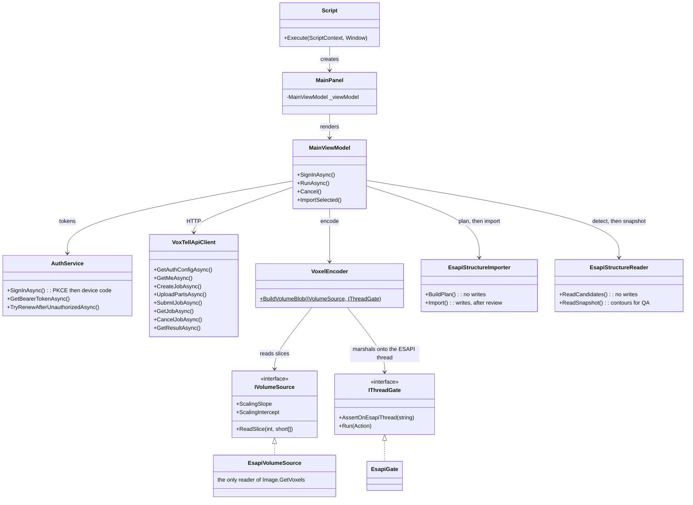

# VoxTell Interface

> C# ESAPI plugin that connects Varian Eclipse to the VoxTell segmentation server for AI-powered contouring.

[**Root README**](../README.md) · [**Backend README**](../voxtell-cloud/README.md) · [**Wire protocol**](../voxtell-cloud/PROTOCOL.md)

> [!NOTE]
> This plugin speaks the **v2** protocol specified in
> [PROTOCOL.md](../voxtell-cloud/PROTOCOL.md): Keycloak SSO, one presigned upload of the
> whole volume as int16, a job queue with cancellation, and an explicit review step before
> anything is written into a structure set.

---

## Table of Contents

- [Proprietary DLL Notice](#proprietary-dll-notice)
- [Prerequisites](#prerequisites)
- [Build Instructions](#build-instructions)
- [Installation in Eclipse](#installation-in-eclipse)
- [Usage Workflow](#usage-workflow)
- [Architecture](#architecture)
- [Configuration Notes](#configuration-notes)
- [License](#license)

---

## Proprietary DLL Notice

> [!IMPORTANT]
> This plugin depends on **Varian Medical Systems proprietary DLL files** (`VMS.TPS.Common.Model.API.dll` and related assemblies from RTM 16.1) that are **not redistributable** and are **not included** in this repository.
>
> You **must** have a licensed installation of Varian Eclipse to obtain these files. See [Build Instructions](#build-instructions) for details.

---

## Download (Pre-built)

The easiest way to install the plugin is to download the pre-built release ZIP — no build environment needed.

1. Go to the [Releases page](https://github.com/gomesgustavoo/VoxTell-ESAPI/releases) and download the latest `VoxTell-Interface.zip`
2. Extract the ZIP — it contains:
   - `VoxTell-Interface.esapi.dll` — the compiled Eclipse plugin
   - `Newtonsoft.Json.dll` — JSON runtime dependency
3. Copy **both DLLs** to your Eclipse scripts directory
4. Follow the [Installation in Eclipse](#installation-in-eclipse) steps below

---

## Prerequisites

- **Varian Eclipse** with ESAPI scripting enabled
- **Windows** (Eclipse's host OS)
- **Visual Studio 2019+** with .NET desktop development workload *(only required if building from source)*
- **.NET Framework 4.6.2** targeting pack
- A reachable **[VoxTell Cloud](../voxtell-cloud/README.md)** backend (the hosted service, or your own — see the backend README) plus an API key

---

## Build Instructions

The project reads the Varian assemblies straight from the Eclipse installation via the
`VarianApiDir` MSBuild property, which defaults to
`C:\Program Files (x86)\Varian\RTM\16.1\esapi\API`. Nothing needs copying.

> [!NOTE]
> Earlier revisions of this README asked you to copy the DLLs into `reference/`. Nothing
> ever read them from there — the csproj referenced the install path directly.

### Visual Studio

Open `VoxTell-Interface.sln`, set **Release** / **x64**, and build. The post-build step
copies the output to `VoxTell-Interface.esapi.dll`.

### Command line

```
msbuild VoxTell-Interface.sln /p:Configuration=Release /p:Platform=x64
```

If Eclipse is installed elsewhere, or you are on a different RTM version, point the build at it:

```
msbuild VoxTell-Interface.sln /p:Configuration=Release /p:Platform=x64 /p:VarianApiDir="D:\Varian\RTM\16.1\esapi\API"
```

### Testing without Eclipse

The solution also builds `VoxTell-Interface.Harness`, a console app that links the same
sources minus anything touching `VMS.TPS.Common.Model.*` and drives the whole protocol
against a synthetic phantom. It needs no patient, no CT and no script approval, so it is the
fast loop for auth, the wire format and the geometry round trip:

```
VoxTell-Harness.exe --base https://voxtell.dicomsegvr.com/v1
VoxTell-Harness.exe --device        # block the loopback ports, forcing the device-code flow
VoxTell-Harness.exe --api-key vxt_...
```

A synthetic phantom is not anatomy, so the model will usually segment nothing from it — that
is a pass, not a failure. What the harness proves is that sign-in, the upload, the job
lifecycle and the result download all work; it verifies contour geometry only for whatever
does come back. For a real geometry check use `voxtell-cloud/scripts/e2e_client.py` with
actual DICOM, or the plugin itself in Eclipse.

---

## Installation in Eclipse

1. Copy `VoxTell-Interface.esapi.dll` from the build output directory to your Eclipse scripts folder (consult your Eclipse administrator for the path)
2. In Eclipse, open the **Scripting** menu and load the `VoxTell-Interface` script
3. The plugin requires **write access** to the patient's structure set — ensure the script is approved for write operations in your Eclipse configuration

---

## Usage Workflow

> [!IMPORTANT]
> The open patient in Eclipse must already have a **structure set** created and selected before you run any segmentation prompts. The plugin imports contours into the active structure set — it cannot create a structure set from scratch.

1. **Open a patient** in Eclipse with a CT image and an existing structure set
2. **Launch the plugin** from the scripting menu — the VoxTell AI Segmentation window opens
3. **Sign in** — the plugin opens your browser at the shared DicomSegVR Keycloak realm and
   catches the redirect on a loopback port. On a workstation with no free port or no
   registered browser it falls back to a short code you approve from any device. The session
   is remembered between runs, so this is normally a one-off.
4. **Choose what to segment** — either **Structures** (a preset, or the structures
   already on the series, detected automatically) or **Prompts** (one anatomical
   name per line, up to 16). The model list comes from the server, so a new model
   needs no new DLL.
5. **Segment** — the volume is read, compressed and uploaded once, then the job queues on the
   shared GPU. The panel shows the queue position, then the server's own progress message,
   which is what distinguishes "waiting for the GPU" from "stuck".
6. **Review** — every prompt appears as a row: the structure Id it would write, its DICOM
   type, the voxel and contour counts, and whether it creates a new structure or overwrites
   an existing one. Rename, retype, or untick anything.
7. **Import ticked structures** — only now is anything written. New structures are created;
   an existing structure has its contours cleared on the affected slices first, so re-running
   a prompt replaces rather than superimposes.
8. **Save in Eclipse** — the plugin never saves for you. Nothing is persisted until you do.

---

## Architecture



### Module Reference

Only three files touch `VMS.TPS.Common.Model.*`. That is deliberate: it keeps the Eclipse
surface small enough to review in one sitting, and it lets everything else run in the harness.

| File | Purpose | ESAPI |
|---|---|---|
| [`Script.cs`](VoxTell-Interface/Script.cs) | ESAPI entry point — `VMS.TPS.Script`, unlocks write access, hosts the UI | yes |
| [`Services/EsapiGate.cs`](VoxTell-Interface/Services/EsapiGate.cs) | Marshals work onto the ESAPI thread and asserts when something is on the wrong one | — |
| [`Services/EsapiVolumeSource.cs`](VoxTell-Interface/Services/EsapiVolumeSource.cs) | The only reader of `Image.GetVoxels` and the image geometry; derives the HU rescale | yes |
| [`Services/EsapiStructureImporter.cs`](VoxTell-Interface/Services/EsapiStructureImporter.cs) | Plans the import, then writes structures once ticked | yes |
| [`Services/IVolumeSource.cs`](VoxTell-Interface/Services/IVolumeSource.cs) · [`IThreadGate.cs`](VoxTell-Interface/Services/IThreadGate.cs) | The two seams that keep ESAPI out of everything below | — |
| [`Services/VoxelEncoder.cs`](VoxTell-Interface/Services/VoxelEncoder.cs) | Builds `gzip(int16-LE, C-order (Z,Y,X))` for the whole volume | — |
| [`Services/VoxTellApiClient.cs`](VoxTell-Interface/Services/VoxTellApiClient.cs) | The v2 protocol: jobs, presigned multipart upload, polling, results | — |
| [`Services/Auth/`](VoxTell-Interface/Services/Auth) | PKCE loopback flow, device-code fallback, DPAPI credential store | — |
| [`Models/ApiModels.cs`](VoxTell-Interface/Models/ApiModels.cs) | Wire DTOs and the typed API error | — |
| [`ViewModels/MainViewModel.cs`](VoxTell-Interface/ViewModels/MainViewModel.cs) | Workflow orchestration | — |
| [`Services/EsapiStructureReader.cs`](VoxTell-Interface/Services/EsapiStructureReader.cs) | Reads structures back — `GetContoursOnImagePlane`, approval, volume, islands | yes (read-only) |
| [`Services/StructureAutoDetect.cs`](VoxTell-Interface/Services/StructureAutoDetect.cs) | Matches existing structures to the catalog; surfaces the unrecognised | — |
| [`Services/LineageKeys.cs`](VoxTell-Interface/Services/LineageKeys.cs) | HMACs a series UID so no identifier reaches the cloud | — |
| [`Models/ModelCatalog.cs`](VoxTell-Interface/Models/ModelCatalog.cs) | The catalog from `GET /v1/models`; no model list is compiled in | — |
| [`Models/QaModels.cs`](VoxTell-Interface/Models/QaModels.cs) | QA snapshot DTOs and the content hash used for idempotency | — |
| [`Views/Theme.cs`](VoxTell-Interface/Views/Theme.cs) · [`Ui.cs`](VoxTell-Interface/Views/Ui.cs) · [`TemplateFactory.cs`](VoxTell-Interface/Views/TemplateFactory.cs) · [`Controls.cs`](VoxTell-Interface/Views/Controls.cs) | The WPF design system: palette, type scale, layout factories, control templates | — |
| [`Views/MainPanel.cs`](VoxTell-Interface/Views/MainPanel.cs) · [`ReviewList.cs`](VoxTell-Interface/Views/ReviewList.cs) · [`ModelPicker.cs`](VoxTell-Interface/Views/ModelPicker.cs) · [`StepRail.cs`](VoxTell-Interface/Views/StepRail.cs) | The panel. Pure WPF — no WinForms, no `WindowsFormsHost`, no DPI arithmetic | — |

---

## Configuration Notes

| Setting | Details |
|---|---|
| **Server URL** | Defaults to `https://voxtell.dicomsegvr.com/v1`, overridable under **Server & API key** and remembered per user. |
| **Credentials** | Keycloak SSO by default; a `vxt_` API key is accepted for unattended workstations. Both are stored under `%LOCALAPPDATA%\VoxTell` encrypted with DPAPI (`CurrentUser` scope), so another account on a shared workstation cannot read them. |
| **Sign-in** | Authorization Code + PKCE against `http://127.0.0.1:{47653,47654,47655}/callback`. Those ports are registered verbatim on the `voxtell-esapi` Keycloak client — Keycloak's redirect wildcard is path-only, so they cannot be ephemeral and must stay in sync with `OIDC_REDIRECT_PORTS` in the API config. Falls back to the device-code flow. |
| **HTTP timeouts** | Per call, not one global value: 10 min per 32 MiB upload part, 5 min for a result download, 60 s to create a job, 30 s to poll. Retries 5 times with exponential backoff on 502/503/504 and Cloudflare's 52x/530 — except `POST /jobs`, which is not idempotent. |
| **Structure names** | Separators become `_`, other invalid characters are dropped, truncated to Eclipse's 16-character limit, then de-duplicated with a numeric suffix. `"left kidney"` becomes `left_kidney`. |
| **Write access** | `[assembly: ESAPIScript(IsWriteable = true)]`, but `BeginModifications()` is deferred to immediately **before the first write** and gated on `Patient.CanModifyData()` — not called on launch. Opening the panel therefore does not mark the patient modified, and reading structures back for QA needs no unlock at all. The plugin never calls `SaveModifications` — you save in Eclipse. |
| **QA baselines** | Writing structures also records what was written as the QA baseline for the series, keyed on `HMAC-SHA256(series UID)` under a per-tenant secret from `GET /v1/me`. No DICOM UID, patient name or id is ever sent. Unavailable — and the panel says so — when the deployment has no lineage secret or the series has no UID. |
| **Structure matching** | An existing structure name is matched to the catalog on a normalised key (lowercase, alphanumerics only), so `Kidney_R`, `Kidney R` and `kidney-r` all match. Unmatched names are **listed for the planner**, never silently skipped. |
| **Threading** | `Image.GetVoxels` and every structure write run on the ESAPI thread, enforced by `EsapiGate.AssertOnEsapiThread` rather than assumed. Compression and HTTP run off it, which is why the Eclipse UI stays responsive during an upload. |
| **Limits** | 16 prompts, 200 characters each, checked client-side before the volume is read (structure ids are capped far higher, since the whole CADS set is 167). 6 outstanding jobs per user; a 429 is a wait, not a failure. |
| **Offline checks** | `VoxTell-Harness.exe --selftest` runs 62 assertions over the name-normalisation contract, the auto-detect skip rules, the snapshot content hash and the lineage keys — no Eclipse, no server, no credential. These are the paths that fail *silently* in the field. |

---

## License

The C# source code in this directory is original work and is released under the **Apache 2.0 License** (see [LICENSE](../LICENSE)), consistent with the upstream VoxTell project.

> [!NOTE]
> The compiled plugin links against Varian proprietary DLLs at build time. These DLLs are subject to Varian's own licensing terms and are not covered by this project's Apache 2.0 license.
