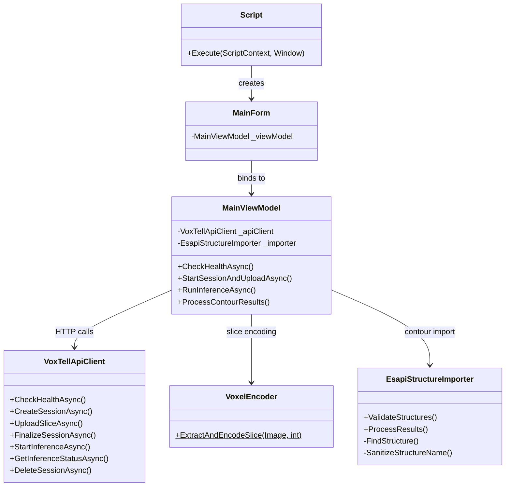

# VoxTell Interface

> C# ESAPI plugin that connects Varian Eclipse to the VoxTell segmentation server for AI-powered contouring.

[**Root README**](../README.md) · [**Server README**](../voxtell-server/README.md)

---

## Table of Contents

- [Proprietary DLL Notice](#proprietary-dll-notice)
- [Prerequisites](#prerequisites)
- [Build Instructions](#build-instructions)
- [Installation in Eclipse](#installation-in-eclipse)
- [Usage Workflow](#usage-workflow)
- [Architecture](#architecture)
- [Configuration Notes](#configuration-notes)
- [License](#license)

---

## Proprietary DLL Notice

> [!IMPORTANT]
> This plugin depends on **Varian Medical Systems proprietary DLL files** (`VMS.TPS.Common.Model.API.dll` and related assemblies from RTM 16.1) that are **not redistributable** and are **not included** in this repository.
>
> You **must** have a licensed installation of Varian Eclipse to obtain these files. See [Build Instructions](#build-instructions) for details.

---

## Download (Pre-built)

The easiest way to install the plugin is to download the pre-built release ZIP — no build environment needed.

1. Go to the [Releases page](https://github.com/gomesgustavoo/VoxTell-ESAPI/releases) and download the latest `VoxTell-Interface.zip`
2. Extract the ZIP — it contains:
   - `VoxTell-Interface.esapi.dll` — the compiled Eclipse plugin
   - `Newtonsoft.Json.dll` — JSON runtime dependency
3. Copy **both DLLs** to your Eclipse scripts directory
4. Follow the [Installation in Eclipse](#installation-in-eclipse) steps below

---

## Prerequisites

- **Varian Eclipse** with ESAPI scripting enabled
- **Windows** (Eclipse's host OS)
- **Visual Studio 2019+** with .NET desktop development workload *(only required if building from source)*
- **.NET Framework 4.6.2** targeting pack
- A running **[VoxTell Server](../voxtell-server/README.md)** accessible from the Eclipse workstation

---

## Build Instructions

### 1. Locate Varian DLLs

Find the following files in your Eclipse installation directory (typically `C:\Program Files\Varian\RTM\<version>\`):

- `VMS.TPS.Common.Model.API.dll`
- `VMS.TPS.Common.Model.Types.dll`

### 2. Copy DLLs to the reference directory

```
voxtell_interface/
└── reference/
    ├── VMS.TPS.Common.Model.API.dll      ← copy here
    └── VMS.TPS.Common.Model.Types.dll    ← copy here
```

### 3. Open the solution

Open `voxtell_interface/VoxTell-Interface.sln` in Visual Studio.

### 4. Build

- Set configuration to **Release** and platform to **x64**
- Build the solution (`Ctrl+Shift+B`)
- The post-build step automatically renames the output to `VoxTell-Interface.esapi.dll`

---

## Installation in Eclipse

1. Copy `VoxTell-Interface.esapi.dll` from the build output directory to your Eclipse scripts folder (consult your Eclipse administrator for the path)
2. In Eclipse, open the **Scripting** menu and load the `VoxTell-Interface` script
3. The plugin requires **write access** to the patient's structure set — ensure the script is approved for write operations in your Eclipse configuration

---

## Usage Workflow

> [!IMPORTANT]
> The open patient in Eclipse must already have a **structure set** created and selected before you run any segmentation prompts. The plugin imports contours into the active structure set — it cannot create a structure set from scratch.

1. **Open a patient** in Eclipse with a CT image and an existing structure set
2. **Launch the plugin** from the scripting menu — the VoxTell AI Segmentation window opens
3. **Check server health** — Click the health check button to verify the VoxTell Server is reachable
4. **Start session & upload** — The plugin extracts CT slices from the open image, compresses each slice (gzip + base64), and streams them to the server. A progress bar tracks upload status.
5. **Enter prompts** — Type anatomical names separated by commas or newlines (e.g. `liver, left kidney, spleen`)
6. **Run inference** — The plugin submits the prompts to the server and polls for results every 2 seconds
7. **Import structures** — Once inference completes, contours are automatically imported into Eclipse:
   - Existing structures are matched by name (exact, case-insensitive, or fuzzy)
   - Missing structures are auto-created with DICOM type `CONTROL`
   - Contour points are applied via `AddContourOnImagePlane()` for each z-slice
8. **Review** — Verify the imported contours in the Eclipse contouring workspace

---

## Architecture



### Module Reference

| File | Purpose |
|---|---|
| [`Script.cs`](VoxTell-Interface/Script.cs) | ESAPI entry point — initializes write access and launches UI |
| [`Models/ApiModels.cs`](VoxTell-Interface/Models/ApiModels.cs) | Data transfer objects matching the server's JSON schema |
| [`Services/VoxTellApiClient.cs`](VoxTell-Interface/Services/VoxTellApiClient.cs) | HTTP client wrapping all REST API calls with error handling |
| [`Services/VoxelEncoder.cs`](VoxTell-Interface/Services/VoxelEncoder.cs) | Extracts CT voxels from ESAPI, encodes as gzip+base64 |
| [`Services/EsapiStructureImporter.cs`](VoxTell-Interface/Services/EsapiStructureImporter.cs) | Imports LPS contour points into Eclipse structures (match or auto-create) |
| [`ViewModels/MainViewModel.cs`](VoxTell-Interface/ViewModels/MainViewModel.cs) | UI logic, async workflow orchestration, progress tracking |
| [`Views/MainForm.cs`](VoxTell-Interface/Views/MainForm.cs) | WPF user interface (dark theme, embedded in Eclipse window) |

---

## Configuration Notes

| Setting | Details |
|---|---|
| **Server URL** | Default `http://localhost:8000` — configurable in the UI. The server must be reachable from the Eclipse workstation (LAN or localhost). |
| **HTTP timeout** | 5 minutes — sufficient for large CT uploads and inference. |
| **Structure names** | Sanitized to 16 characters max, alphanumeric plus `_` and `-`. Prompts like `"left kidney"` become `left_kidney`. |
| **Write access** | The plugin calls `context.Patient.BeginModifications()` on launch. The ESAPI script must be configured with write permissions in Eclipse. |
| **Threading** | Voxel extraction runs on the main STA thread (ESAPI requirement). API calls and polling use async/await with `CancellationToken` support. |

---

## License

The C# source code in this directory is original work and is released under the **Apache 2.0 License** (see [LICENSE](../voxtell-server/LICENSE)), consistent with the upstream VoxTell project.

> [!NOTE]
> The compiled plugin links against Varian proprietary DLLs at build time. These DLLs are subject to Varian's own licensing terms and are not covered by this project's Apache 2.0 license.
