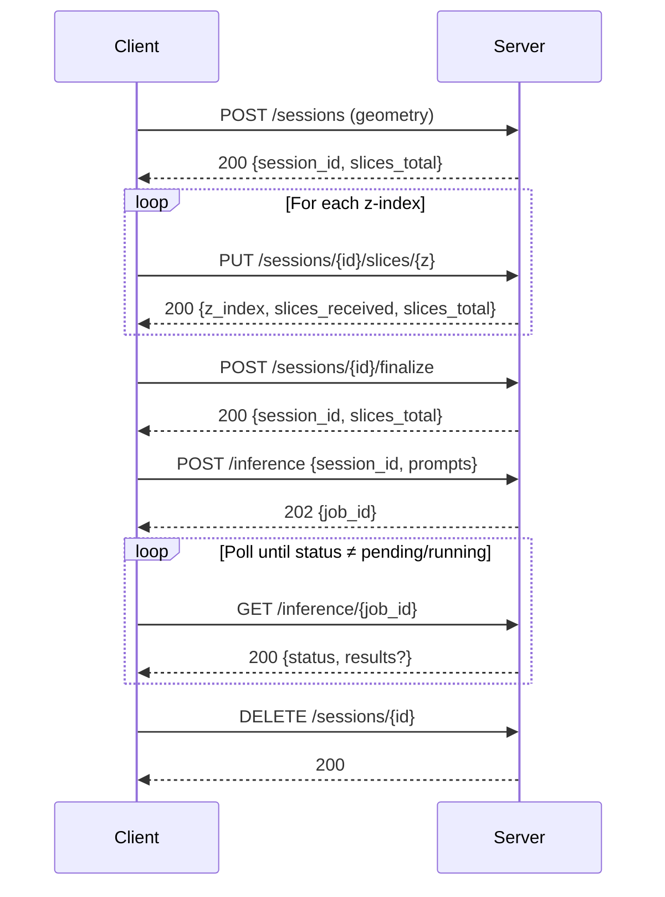

# VoxTell Server

> Python/FastAPI backend that accepts CT data over HTTP, runs VoxTell inference, and returns DICOM LPS contour points.

[**Root README**](../README.md) · [**Interface README**](../voxtell_interface/README.md)

---

## Table of Contents

- [Prerequisites](#prerequisites)
- [Installation](#installation)
- [Configuration](#configuration)
- [API Reference](#api-reference)
- [The Data Conversion Pipeline](#the-data-conversion-pipeline)
  - [1. DICOM Geometry → LPS Affine](#1-dicom-geometry--lps-affine)
  - [2. ESAPI Voxels → NIfTI (LPS → RAS)](#2-esapi-voxels--nifti-lps--ras)
  - [3. VoxTell Inference](#3-voxtell-inference)
  - [4. Segmentation Masks → LPS Contour Points](#4-segmentation-masks--lps-contour-points)
- [Module Reference](#module-reference)
- [License](#license)

---

## Prerequisites

- **Linux** with **NVIDIA GPU** and **CUDA 11.8+** (CPU inference is supported but slow for clinical volumes)
- [Miniconda](https://docs.anaconda.com/miniconda/) or Anaconda
- **Python 3.12**
- **~20 GB disk** for model weights and text encoder

---

## Installation

### 1. Create the environment

```bash
conda create -n voxtell python=3.12 -y
conda activate voxtell
```

### 2. Install PyTorch (CUDA)

```bash
pip install torch --index-url https://download.pytorch.org/whl/cu118
```

### 3. Install this package with API extras

```bash
git clone https://github.com/gomesgustavoo/VoxTell-ESAPI.git
cd VoxTell-ESAPI/voxtell-server
pip install -e ".[api]"
```

### 4. Download the VoxTell model weights

```bash
python download_model.py
```

Or set `VOXTELL_MODEL_DIR` to point to a directory containing `plans.json` and `fold_0/checkpoint_final.pth`.

### 5. Start the server

```bash
VOXTELL_MODEL_DIR=./models bash run.sh
```

Or copy `.env.example` to `.env`, fill in the values, and run `bash run.sh`.

### 6. Verify

```bash
curl http://localhost:8000/health
# {"status":"ok","model_loaded":true}
```

The interactive API docs (Swagger UI) are available at `http://localhost:8000/docs`.

---

## Configuration

All settings are configured through environment variables or a `.env` file. See [`.env.example`](.env.example) for the template.

| Variable | Default | Description |
|---|---|---|
| `VOXTELL_MODEL_DIR` | *(required)* | Path to model directory (`plans.json` + `fold_0/`) |
| `VOXTELL_DEVICE` | `cuda` | `cuda` or `cpu` |
| `VOXTELL_GPU_ID` | `0` | GPU index when using CUDA |
| `VOXTELL_TEXT_MODEL` | `Qwen/Qwen3-Embedding-4B` | HuggingFace text encoder model ID |
| `VOXTELL_SESSION_DIR` | `/tmp/voxtell_sessions` | Where NIfTI session files are stored |
| `VOXTELL_SESSION_TTL_SECONDS` | `7200` | Session expiry in seconds (default: 2 hours) |
| `VOXTELL_CLEANUP_INTERVAL_SECONDS` | `300` | Background cleanup task interval in seconds |
| `VOXTELL_HOST` | `0.0.0.0` | Uvicorn bind address |
| `VOXTELL_PORT` | `8000` | Uvicorn port |

---

## API Reference

| Method | Endpoint | Description |
|--------|----------|-------------|
| `GET` | `/health` | Check server and model status |
| `POST` | `/sessions` | Create a session with volume geometry metadata |
| `PUT` | `/sessions/{id}/slices/{z}` | Upload one gzip+base64 encoded CT slice |
| `POST` | `/sessions/{id}/finalize` | Assemble all slices into a NIfTI file |
| `DELETE` | `/sessions/{id}` | Remove session and its NIfTI file |
| `POST` | `/inference` | Submit segmentation job with text prompts |
| `GET` | `/inference/{job_id}` | Poll job status and retrieve LPS contour results |

### Session Lifecycle



> [!NOTE]
> Interactive documentation (Swagger UI) is available at `http://localhost:8000/docs` when the server is running.

---

## The Data Conversion Pipeline

This is the **technical core** of the project. Moving data between Eclipse's DICOM world and a deep learning model requires careful coordinate system management at every step.

### 1. DICOM Geometry → LPS Affine

Eclipse exposes image geometry through ESAPI properties (`image.Origin`, `image.RowDirection`, `image.ColumnDirection`, `image.XRes`, etc.). The C# script serialises these and sends them to `POST /sessions`.

The server constructs a **4×4 affine matrix** that maps integer voxel indices `(x, y, z)` to millimetre positions in the **DICOM LPS patient coordinate system** (Left, Posterior, Superior):

```python
affine_lps[:3, 0] = row_direction    * x_res   # column  (+X) axis
affine_lps[:3, 1] = col_direction    * y_res   # row     (+Y) axis
affine_lps[:3, 2] = slice_direction  * z_res   # slice   (+Z) axis
affine_lps[:3, 3] = origin                     # position of voxel (0,0,0)
```

This affine is stored in the session and re-used both for NIfTI construction and later for back-projecting contour points.

### 2. ESAPI Voxels → NIfTI (LPS → RAS)

**Why this is non-trivial:**

| System | X | Y | Z |
|---|---|---|---|
| DICOM / Eclipse (LPS) | Patient Left | Patient Posterior | Patient Superior |
| NIfTI / VoxTell (RAS) | Patient **Right** | Patient **Anterior** | Patient Superior |

The first two axes are flipped. A naive copy would produce a mirrored, anteroposterior-inverted volume.

**On the C# side** (`VoxelEncoder.cs`): each 2D slice is extracted from the ESAPI `Frame` as `ushort[xSize, ySize]`, widened to `int32`, serialised as **little-endian bytes**, **gzip-compressed**, and **base64-encoded** before being sent via `PUT /sessions/{id}/slices/{z}`. This reduces HTTP payload size by ~4×.

```csharp
// ushort → int32 LE bytes → gzip → base64
ushort[,] voxels = new ushort[xSize, ySize];
frame.GetVoxels(zIndex, voxels);
// ... (see VoxelEncoder.cs)
return Convert.ToBase64String(compressedBytes);
```

**On the Python side** (`nifti_builder.py`): slices are decoded and accumulated into an `int32 (Z, Y, X)` NumPy buffer. At finalisation:

```python
# 1. Transpose (Z,Y,X) → (X,Y,Z) for NIfTI axis convention
arr_xyz = volume.transpose(2, 1, 0).astype(np.float32)

# 2. Flip X and Y to convert LPS → RAS
affine_ras = np.diag([-1.0, -1.0, 1.0, 1.0]) @ affine_lps

# 3. Save NIfTI
nib.Nifti1Image(arr_xyz, affine_ras).to_filename(output_path)
```

The LPS affine is **preserved intact** in the session — it is needed in step 4 to map predictions back to DICOM space.

### 3. VoxTell Inference

The VoxTell worker loads the NIfTI volume and runs the segmentation model against a list of free-text anatomical prompts (e.g., `["liver", "spleen", "right kidney"]`). The text encoder uses **Qwen3-Embedding-4B** to produce prompt embeddings that guide the 3D segmentation head.

Inference runs in a **background `asyncio` task** and results are polled via `GET /inference/{job_id}`, so the Eclipse UI thread is never blocked.

The model's output is a set of **binary 3D masks** in the model's internal RAS orientation — one mask per prompt.

### 4. Segmentation Masks → LPS Contour Points

This step inverts the NIfTI orientation and back-projects predictions into DICOM-compatible coordinates (`contour_utils.py`).

1. **Write back to original DICOM orientation** using `nnUNet`'s `NibabelIOWithReorient.write_seg()`, which reverses whatever reorientation nibabel applied when loading.
2. **Extract 2D contour lines** per z-slice using `skimage.measure.find_contours` (operating on the `(X, Y)` voxel plane).
3. **Convert voxel indices → LPS mm** using the stored affine:

```python
# vox_coords: (N, 4) homogeneous voxel indices [x, y, z, 1]
pts_lps = (vox_coords @ affine_lps.T)[:, :3]
```

The result — `ContourSlice` objects containing `points_lps` — can be passed **directly** to Eclipse's structure API:

```csharp
structure.AddContourOnImagePlane(contour_points_lps, z_index);
```

---

## Module Reference

| Module | Purpose |
|---|---|
| [`main.py`](api/main.py) | FastAPI app, route definitions, lifespan events, background job execution |
| [`schemas.py`](api/schemas.py) | Pydantic models for all request and response payloads |
| [`config.py`](api/config.py) | `Settings` class — loads environment variables with `VOXTELL_` prefix |
| [`session_manager.py`](api/session_manager.py) | In-memory session and job stores, TTL-based cleanup loop |
| [`nifti_builder.py`](api/nifti_builder.py) | LPS affine construction, slice decoding, LPS→RAS NIfTI assembly |
| [`contour_utils.py`](api/contour_utils.py) | RAS mask → DICOM LPS contour extraction via `find_contours` + affine projection |
| [`voxtell_worker.py`](api/voxtell_worker.py) | Async-safe wrapper around `VoxTellPredictor` with GPU lock |

---

## License

The Python source code in this repository (the `api/` package) is original work and is released under the **Apache 2.0 License** (see [LICENSE](LICENSE)), consistent with the upstream VoxTell project.
